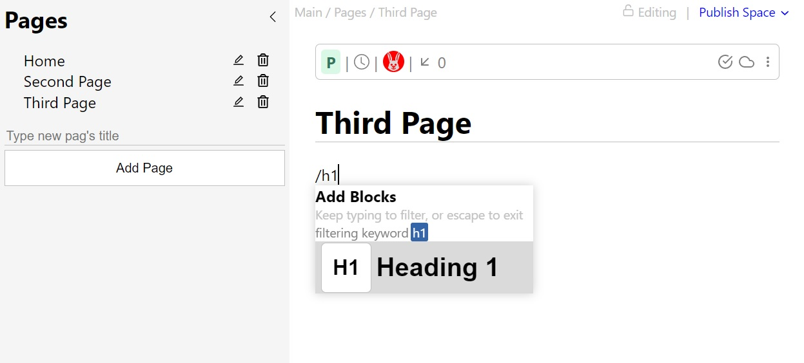
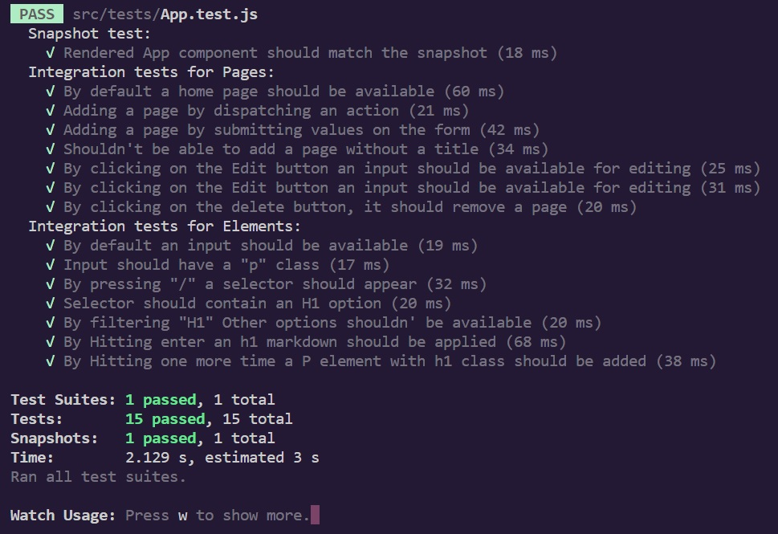
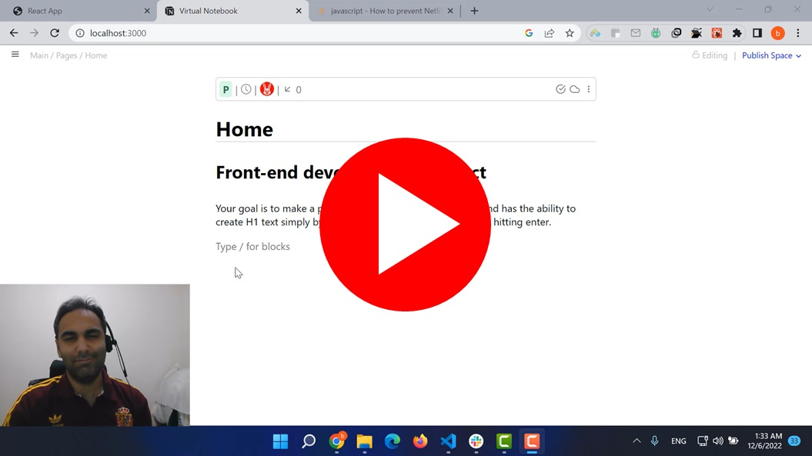

# Virtual Notebook
A note keeper application inspired by notion. Users can add notes with specific marksowns into multiple pages.

# Requirements for this project

Please find the requirements for this project [here](https://docs.google.com/document/d/161n6pubqHfmIiDVA6dOlhqUZlpQiTfG0_8hUTHAAEzc/edit#).

# screenshot 

## Technologies

- React
- Redux
- JEST & React testing library

## Live Demo
You can find the live demo on [Netlify](https://my-virtual-notebook.netlify.app/). 

You can also watch the below presentational video. 

## Getting Started

To get a local copy follow these simple example steps.  

1. Open the terminal window and clone the repository using this command:  
`git clone https://github.com/Behnam1369/virtual-notebook.git` 
2. Change the directory to the react-bookstore directory:  
`cd virtual-notebook`  
3. Install the project's dependencies by running this command:   
`npm install`   
4. Run the application using:  
`npm start`  
5. For runnig the application tests excute below command:   
`npm run test` 

## Authors

👤 **Behnam Aghaali**

- GitHub: [https://github.com/Behnam1369](https://github.com/Behnam1369)
- LinkedIn: [https://www.linkedin.com/in/behnam-aghaali](https://www.linkedin.com/in/behnam-aghaali)
- Twitter: [https://twitter.com/behnamagh1369](https://twitter.com/behnamagh1369)
- Email: [behnam.aghaali@yahoo.com](mailto:behnam.aghaali@yahoo.com)

## 🤝 Contributing

Contributions, issues, and feature requests are welcome!

Feel free to check the [issues page](../../issues/).

## Show your support

Give a ⭐️ if you like this project!
